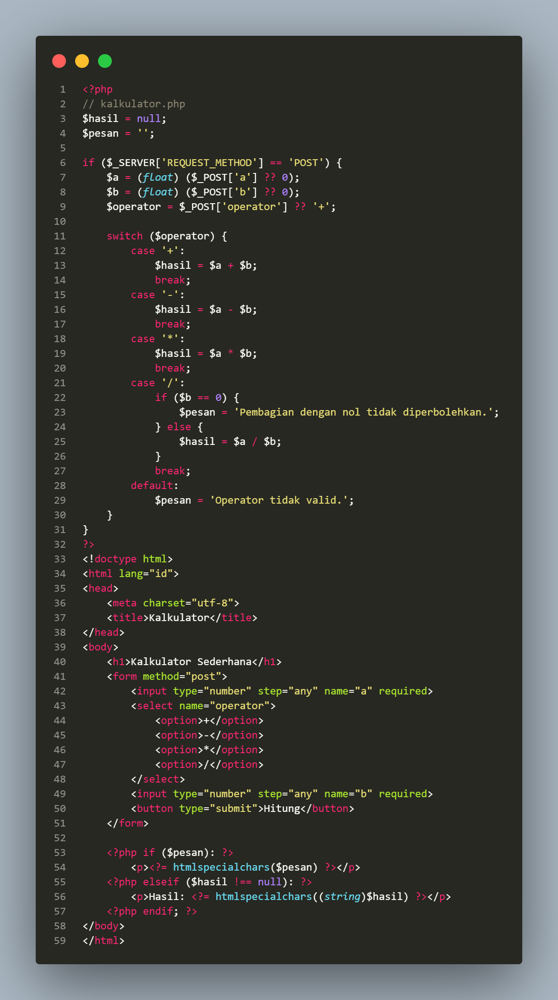
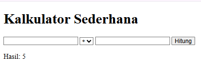
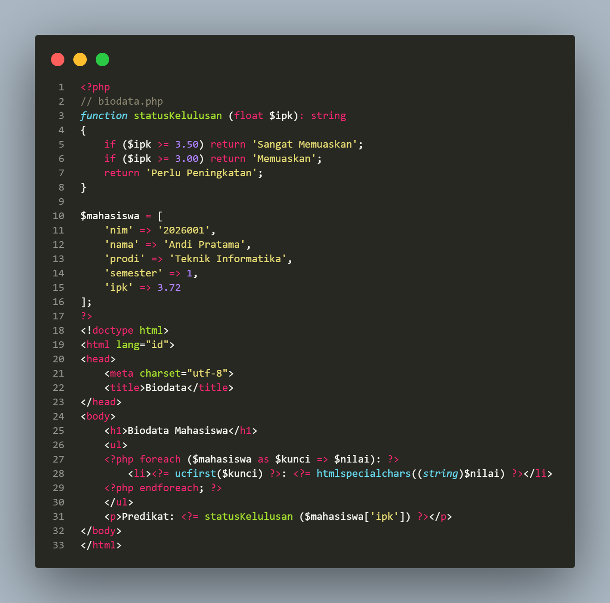
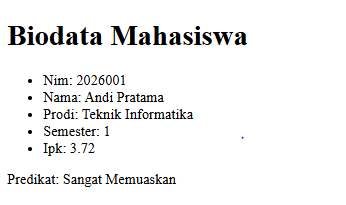
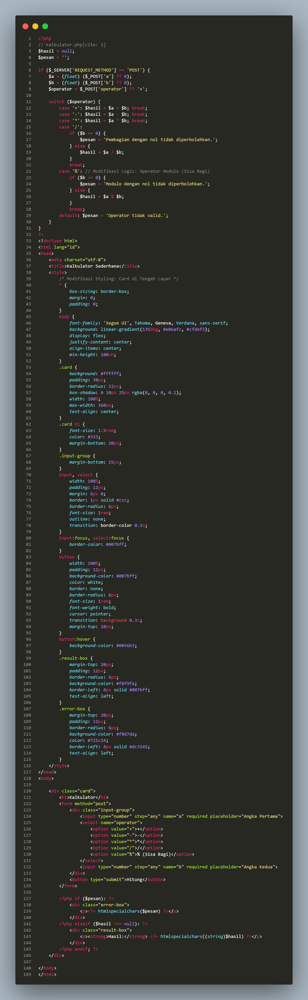
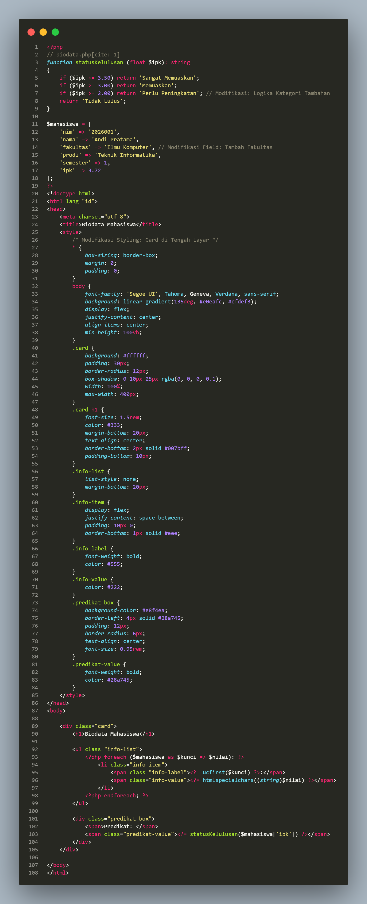
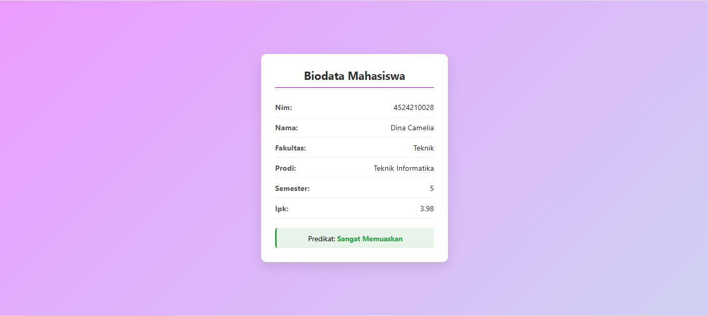

# Laporan Praktikum Pemrograman Web - Tugas 1

Nama: Dina Camelia Putri  
NPM: 4524210028

Laporan ini berisi dokumentasi pelaksanaan **Tugas 1** mata kuliah Pemrograman Web, yang mencakup penyalinan kode contoh Pertemuan 1 (`kalkulator.php` dan `biodata.php`), modifikasi fitur serta antarmuka, penjelasan bagian kode krusial, dan analisis *error*.

---

## 1. Deskripsi Program

Program terdiri dari 4 file :
1. **`Kalkulator.php`**: Aplikasi kalkulator web yang menerima input angka dan jenis operator aritmatika dari pengguna melalui metode HTTP POST, kemudian menampilkan hasil perhitungan.
2. **`Biodata.php`**: Aplikasi yang menampilkan informasi data diri mahasiswa dari variabel array asosiatif beserta predikat kelulusan berdasarkan nilai IPK.
3. **`kalkulatorModifikasi.php`**: Aplikasi kalkulator web yang menerima input angka dan jenis operator aritmatika dari pengguna melalui metode HTTP POST, kemudian menampilkan hasil perhitungan yang sudah dimodifikasi.
4. **`BiodataModifikasi.php`**: Aplikasi yang menampilkan informasi data diri mahasiswa dari variabel array asosiatif beserta predikat kelulusan berdasarkan nilai IPK yang sudah di modifikasi.
---

## 2. Kode Program & Tampilan Sebelum Modifikasi & Sesudah di Modifikasi

### Berikut adalah kode program versi awal beserta tampilan screenshot sebelum dilakukan modifikasi:

Screenshot Program Kalkulator.php:

Output Program:

Screenshot Program Biodata.php:

Output Program:

## 3. Kode Program & Tampilan Setelah Modifikasi

Modifikasi yang diterapkan mencakup:
1. Styling CSS Card Modern: Tampilan diubah menjadi bentuk Card rata tengah (centered) menggunakan Flexbox.
2. Penambahan Operator Modulo (%) pada kalkulator.php untuk menghitung sisa hasil bagi.
3. Penambahan Field fakultas dan logika kategori status kelulusan baru pada biodata.php.
   
### Berikut adalah kode program beserta tampilan screenshot sesudah dilakukan modifikasi:

Screenshot Program KalkulatorModifikasi.php:

Output Program:

Screenshot Program BiodataModifikasi.php:

Output Program:

## 4. Penjelasan 5 Bagian Kode Paling Penting

1. $_SERVER['REQUEST_METHOD'] == 'POST'
   Memastikan logika pemrosesan kalkulator hanya berjalan saat formulir dikirimkan oleh pengguna via tombol submit, bukan ketika halaman pertama kali dibuka via metode GET.
2. $_POST['a'] ?? 0 (Null Coalescing Operator)
   Mencegah munculnya peringatan Error/Warning Undefined array key jika variabel $_POST['a'] belum tersedia, dengan memberikan nilai bawaan 0.
3. switch ($operator)
   Struktur percabangan yang menentukan operasi kalkulasi matematika (penjumlahan, pengurangan, perkalian, pembagian, atau modulo) sesuai pilihan dropdown dari formulir.
4. htmlspecialchars(...)
   Fungsi keamanan wajib yang mengubah karakter khusus HTML menjadi entitas karakter (misalnya < menjadi &lt;). Mencegah serangan Cross-Site Scripting (XSS) saat mencetak variabel ke browser.
5. foreach ($mahasiswa as $kunci => $nilai)
   Perulangan untuk mengekstrak pasangan key-value dari array asosiatif $mahasiswa, sehingga seluruh informasi dapat ditampilkan secara dinamis tanpa perlu pemanggilan manual per properti.

## 5. Error, Penyebab, dan Langkah Perbaikan

- Error:
  Parse error: syntax error, unexpected token '}' in C:\xampp\htdocs\kalkulator.php on line 28
- Penyebab:
  Lupa menambahkan tanda titik koma (;) pada akhir baris perintah pemberian nilai variabel $hasil = $a + $b di dalam blok switch-case.
- Langkah Perbaikan:
  Membuka file kalkulator.php, lalu menambahkan tanda titik koma (;) di ujung baris pernyataan yang terlewat sebelum tanda penutup kurung kurawal }.
