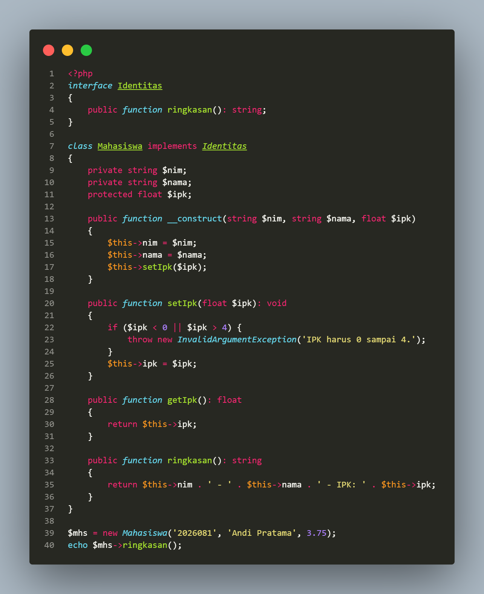
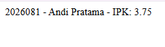
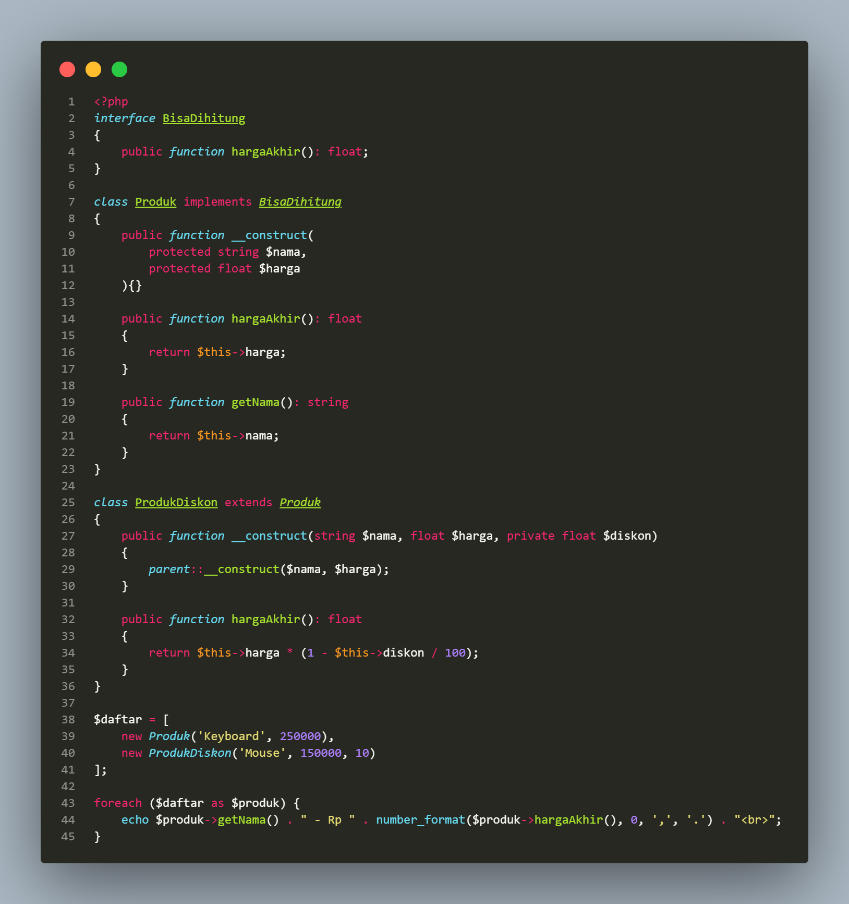
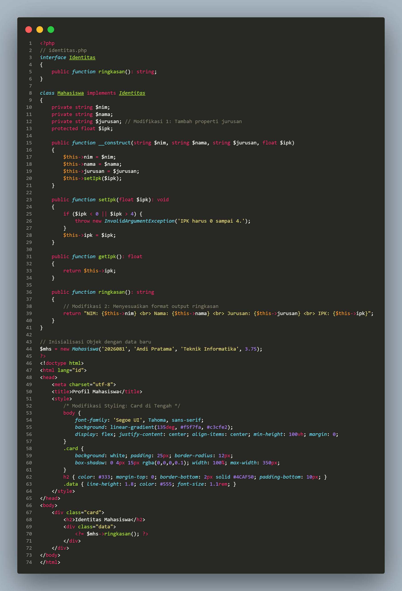
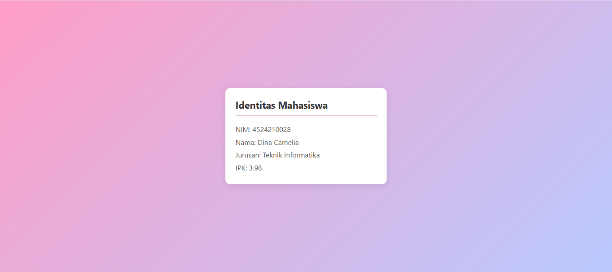
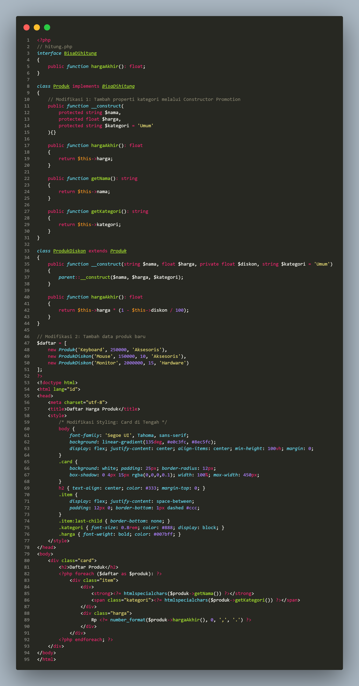
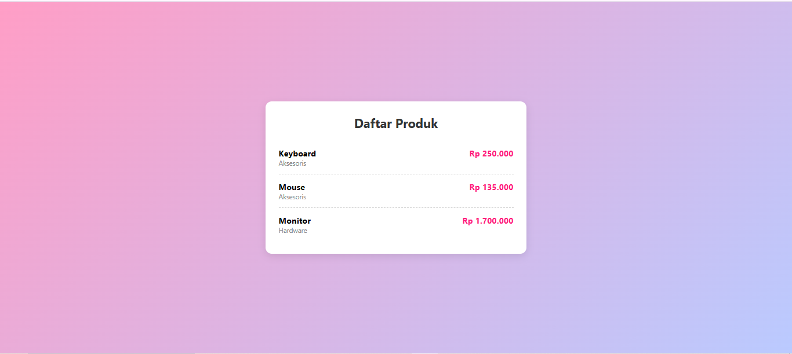

# Laporan Praktikum Pemrograman Web - Tugas 2

Nama: Dina Camelia Putri  
NPM: 4524210028

Laporan ini berisi dokumentasi pelaksanaan **Tugas 2** mata kuliah Pemrograman Web, yang mencakup penyalinan kode contoh Pertemuan 2 (`identitas.php` dan `hitung.php`), modifikasi fitur berbasis Pemrograman Berorientasi Objek (OOP) serta antarmuka, penjelasan bagian kode krusial, dan analisis *error*.

---

## 1. Deskripsi Program

Program terdiri dari 4 file:
1. **`identitas.php`**: Aplikasi berbasis Pemrograman Berorientasi Objek (OOP) yang menerapkan *interface* `Identitas` dan *class* `Mahasiswa` untuk menampilkan ringkasan data mahasiswa.
2. **`hitung.php`**: Aplikasi OOP yang menerapkan *interface* `BisaDihitung`, *class* `Produk`, dan *class* turunan `ProdukDiskon` (*inheritance*) untuk menghitung harga akhir produk.
3. **`identitasModifikasi.php`**: Aplikasi `identitas.php` yang sudah dimodifikasi dengan penambahan properti baru (`$jurusan`), format ringkasan baru, serta tampilan antarmuka *Card* di tengah layar (*centered*).
4. **`hitungModifikasi.php`**: Aplikasi `hitung.php` yang sudah dimodifikasi dengan penambahan properti baru (`$kategori`), data produk baru, serta tampilan *Card* di tengah layar.

---

## 2. Kode Program & Tampilan Sebelum Modifikasi

### Berikut adalah tampilan screenshot program versi awal sebelum dilakukan modifikasi:

Screenshot Program identitas.php:

Output Program:

Screenshot Program hitung.php:

Output Program:

---

## 3. Kode Program & Tampilan Setelah Modifikasi

Modifikasi yang diterapkan mencakup:
1. Penambahan properti/field baru (`$jurusan` pada `identitasModifikasi.php` dan `$kategori` pada `hitungModifikasi.php`).
2. Penerapan styling CSS Card Modern rata tengah (*centered*) menggunakan Flexbox.
3. Penambahan item produk baru dalam array instansiasi objek pada `hitungModifikasi.php`.

### Berikut adalah tampilan screenshot program sesudah dilakukan modifikasi:

Screenshot Program identitasModifikasi.php:

Output Program:

Screenshot Program hitungModifikasi.php:

Output Program:

---

## 4. Penjelasan 5 Bagian Kode Paling Penting

1. `interface Identitas` / `interface BisaDihitung`  
   Mendefinisikan kontrak atau cetak biru metode (seperti `ringkasan()` atau `hargaAkhir()`) yang wajib diimplementasikan oleh *class* yang menggunakannya.
2. `public function __construct(...)`  
   Metode *constructor* yang otomatis dieksekusi saat objek baru diinstansiasi menggunakan kata kunci `new`.
3. `class ProdukDiskon extends Produk`  
   Penerapan konsep *Inheritance* (Pewarisan) di mana *subclass* `ProdukDiskon` mewarisi seluruh properti dan metode dari *superclass* `Produk`.
4. `throw new InvalidArgumentException(...)`  
   Mekanisme penanganan kesalahan (*exception handling*) untuk mencegah pengisian nilai data yang tidak valid (misalnya nilai IPK di luar rentang 0 sampai 4).
5. `parent::__construct(...)`  
   Digunakan di dalam *subclass* untuk memanggil *constructor* milik *parent class* agar inisialisasi variabel utama tetap berjalan secara efisien.

---

## 5. Error, Penyebab, dan Langkah Perbaikan

- Error:  
  `Fatal error: Uncaught InvalidArgumentException: IPK harus 0 sampai 4. in C:\xampp\htdocs\identitas.php on line 22`
- Penyebab:  
  Memasukkan nilai IPK di luar rentang validasi yang ditentukan (misalnya mengisi angka `4.5`) saat membuat objek baru `new Mahasiswa(...)`.
- Langkah Perbaikan:  
  Membuka kode program lalu menyesuaikan argumen IPK pada saat instansiasi objek agar berada dalam rentang validasi yang diizinkan (antara `0` hingga `4`), misalnya `3.75`.
